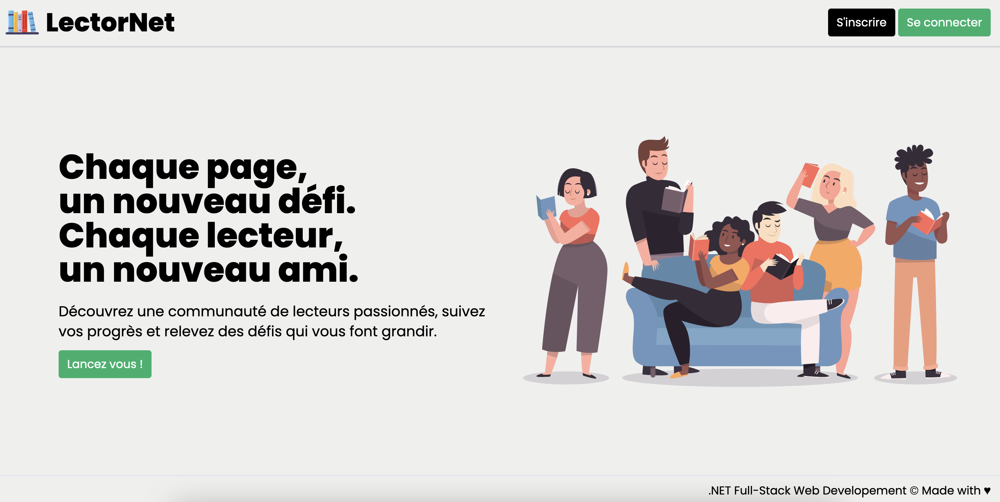

<div align="center">



### This is the source code of the LectorNet web application using .NET 9

</div>

- [Overview](#overview)
- [Backend Architecture](#backend-architecture)
- [Technologies](#technologies)
- [Usage](#usage)
- [API Definition](#api-definition)
  - [Authentication](#authentication)
    - [Register User](#register-user)
      - [Register User Request](#register-user-request)
    - [Login User](#login-user)
      - [Login User Request](#login-user-request)
  - [Book Crud](#book-crud)
    - [Create Book](#create-book)
      - [Create Book Request](#create-book-request)
    - [Get Book](#get-book)
      - [Get Book Request](#get-book-request)
    - [Update Book](#update-book)
      - [Update Book Request](#update-book-request)
    - [Delete Book](#delete-book)
      - [Delete Book Request](#delete-book-request)

---

# Overview

This repository contains a full-stack web application built with .NET 9 technologies. 
The application features a Blazor Server frontend for creating dynamic user interfaces, complemented by a RESTful Web API backend that interfaces with a SQL Server database for data persistence and management.

# Backend Architecture

The backend follows Clean Architecture principles, organized into five distinct layers: API, Application, Contracts, Domain, and Infrastructure. 

These layers ensure separation of concerns and maintainable code.

Here's what each layer represents:
* API: The outermost layer that handles HTTP requests and responses. It exposes endpoints for client applications to interact with the system and manages input validation and authentication.

* Application: Contains the business logic and orchestrates the flow of data between the API and Domain layers. It implements use cases and application-specific rules without knowing about the database or external services.

* Contracts: Defines interfaces, DTOs (Data Transfer Objects), and shared models that establish clear boundaries between layers. This layer helps maintain consistent communication protocols throughout the application.
  
* Domain: The core layer containing business entities. It's independent of other layers and frameworks.

* Infrastructure: This layer implements technical concerns such as database access, external service integrations, file handling. This layer contains concrete implementations of interfaces defined in the Contracts layer, including repository classes, which handle data persistence and retrieval operations.

<div align="center">


</div>

# Technologies

1. ASP.NET web api
2. Blazor (with server interactivity)
3. Rider
4. dotnet CLI
5. SQL server
6. Docker

# Usage

1. Clone the repository: `git clone https://github.com/rachidamrani/lector-csharpdotnet-fullstack-app.git`. 
2. Make sure you have Docker installed on your machine.
3. Navigate to the root folder and run Docker Compose: `docker compose up --build`.
4. Access the application in your browser at : http://localhost:1234.

# API Definition

## Authentication 

### Register User 

#### Register User Request

```js
POST /api/auth/register;
```

```json
{
    "firstname" : "John",
    "lastname" : "Doe",
    "email" : "johndoe@gmail.com",
    "password" : "Pass123@@"
}
```

### Login User 

#### Login User Request

```js
POST /api/auth/login;
```

```json
{
    "email" : "johndoe@gmail.com",
    "password" : "Pass123@@"
}
```

Before creating, updating, or deleting a book, ensure you have created a user. 
The book operations require a request header named 'X-User-Id' containing the corresponding user ID.

## Book Crud

### Create Book

#### Create Book Request

```js
POST /api/books/new;
```

```json
{
    "title": "C# in Depth",
    "author": "John Skeet",
    "isbn": "1617294535",
    "genre": "Informatique",
    "publicationYear": "2019",
    "publishingHouse": "Manning",
    "bookCoverLink": "bookCoverLink",
    "numberOfPages" : 200,
    "alreadyRead" : false
}
```

### Get Book

#### Get Book Request

```js
GET /api/books/{bookId}
```

### Update Book

#### Update Book Request

```js
PUT /api/books/{bookId}
```

```json
{
    "id": "ba16edba-fc7b-4ccf-84a7-ad8dfe480ec5",
    "title": "C# in depth",
    "author": "John Skeet",
    "isbn": "9781617294532",
    "genre": "Informatique",
    "publicationYear": "2020",
    "publishingHouse": "Manning",
    "numberOfPages": 528,
    "alreadyRead": true
}
```

### Delete Book

#### Delete Book Request

```js
DELETE /api/books/{bookId}
```
